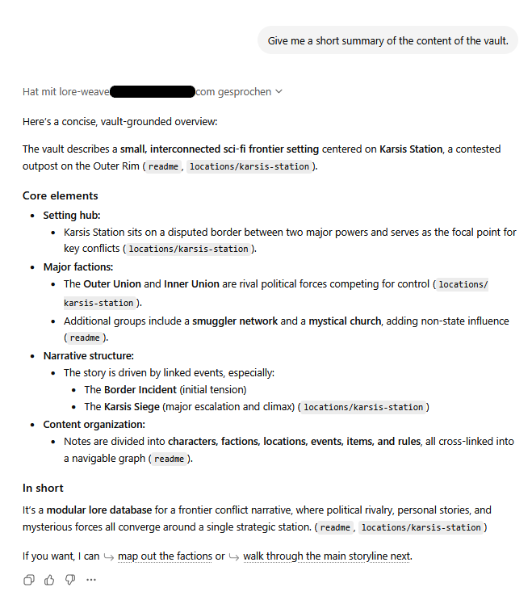

# LoreWeave

A REST API that turns a Git-backed Obsidian vault of markdown notes into a queryable knowledge graph — designed for consumption by AI agents, primarily Custom GPT Actions.

## Status

Implementation is feature-complete and serving a live deployment. Remaining work (the first-deployment checklist) is tracked in [`doc/implementation_plan.md`](doc/implementation_plan.md).

## Running the API

Three ways to launch, in order of "I'm just trying it out" to "this is production":

### Dev mode

```sh
./gradlew quarkusDev
```

Hot reload, debug logging, listens on `http://localhost:4717`. Picks up `src/main/resources/application-dev.properties` automatically.

### Standalone fast-jar

After `./gradlew build`, the runnable artifact is at `build/quarkus-app/`. Copy that whole directory anywhere and launch:

```sh
java -jar quarkus-run.jar
```

Quarkus auto-loads `<working-dir>/config/application.properties` if it exists — that's where deploy-specific overrides go (vault remote URL, bearer token, log path). No `-D` flags required. A starter config that exercises the test vault, keeping the cloned vault and the log files outside the runnable layout (alongside `quarkus-app/` rather than inside it):

```
deploy/
├── quarkus-app/      <- the fast-jar payload (working dir at launch)
│   ├── quarkus-run.jar
│   ├── app/  lib/  quarkus/
│   └── config/
│       └── application.properties
├── vault/            <- ../vault from the working dir
└── logs/             <- ../logs
```

```properties
loreweave.vault.remote=https://github.com/tfassbender/LoreWeaveTestVault.git
loreweave.vault.local-path=../vault
loreweave.auth.token=GENERATE_WITH_openssl_rand_-base64_32
loreweave.logging.path=../logs
quarkus.http.host=0.0.0.0
quarkus.http.port=4717
```

### Linux server with TLS

For a real deployment — systemd unit, Caddy/nginx reverse proxy, Let's Encrypt TLS, hardened file permissions on the token, upgrade procedure — see [`doc/deployment.md`](doc/deployment.md).

## Connecting a Custom GPT

LoreWeave's headline use case: stand it up behind HTTPS and import the OpenAPI spec into a [Custom GPT](https://chatgpt.com/gpts/editor) Action.

### Prerequisites

- The server running and reachable at a public HTTPS URL.
- The bearer token from your `application-local.properties` (or `config/application.properties` in the standalone layout).
- The OpenAPI URL: `https://<your-host>/q/openapi`.

### Configure tab

| Field | Value |
|------|-------|
| **Name** | Anything that fits the vault — e.g. "Karsis Loremaster". |
| **Description** | One-liner about what the GPT does. |
| **Instructions** | The model needs to be told explicitly to use the API rather than fall back on its training data. A working starter prompt is in [`doc/custom_gpt_instructions.md`](doc/custom_gpt_instructions.md) — paste it verbatim and adjust the **SETTING** block to your vault. |
| **Conversation starters** | Three or four representative questions seed the chat UI: e.g. "Tell me about Kael Varyn", "What happened during the Karsis Siege?". |
| **Knowledge** | Empty — content comes through the API, not uploaded files. |
| **Capabilities** | Turn off Web Search, Canvas, DALL·E, and Code Interpreter unless you specifically need them; they nudge the model away from your API. |

### Action setup

1. **Create new action** → **Authentication** (gear icon):
   - Authentication Type: **API Key**
   - Auth Type: **Bearer**
   - API Key: your `loreweave.auth.token` value.
2. **Schema → Import from URL** → paste `https://<your-host>/q/openapi` → **Import**.
3. ChatGPT validates the spec and lists five operations: `getHealth`, `getNote`, `getRelated`, `searchNotes`, `triggerSync`.
4. **Privacy policy URL** — required only when the GPT's visibility is set to "Anyone with the link" or "Everyone". For "Only me" GPTs you can leave it blank.

### Visibility

Save → choose **Only me**. The GPT appears in your account's GPT picker; nobody else can chat with it.

The first time the GPT invokes an action, ChatGPT shows a confirmation modal — click **Always allow** for your domain to silence it on subsequent calls.

### Smoke test

Three prompts that together prove the wiring works:

1. **"Tell me about Kael Varyn"** — fires `searchNotes` then `getNote`. Expect a paragraph with `characters/kael-varyn` cited.
2. **"How is Rex Morrow connected to the Outer Union?"** — fires `getRelated`. Expect a list of neighbors with their relations.
3. **"Who's Greg Rutherford?"** — *not* in the vault. The right answer is "I couldn't find anything in the vault about that." If the GPT invents one anyway, the Instructions aren't strict enough.

A successful answer with citations looks like this:



### When you change the API

If you regenerate the bearer token, redeploy with new endpoints, or change the schema, re-open the Action's edit modal: **Schema → Import from URL** again, then re-paste the token in **Authentication**. ChatGPT caches the spec until you re-import.

## Documentation

### For authors writing notes

- [Authoring guide](doc/authoring_guide.md) — conventions for filenames, links, tags, summaries, and types.
- [Vault schema](doc/vault_schema.md) — formal frontmatter and body rules enforced by the parser.
- [Obsidian templates](examples/obsidian-templates/README.md) — drop-in starter files for each note type.

### For operators deploying the service

- [Deployment guide](doc/deployment.md) — Linux server setup with systemd, Caddy/nginx, TLS, and token handling.
- [Tech stack](doc/tech_stack.md) — language, framework, libraries, and version policy.

### For API consumers (Custom GPT Actions, clients, integrations)

- [OpenAPI spec](doc/open_api_spec.md) — REST contract. Human-readable mirror of the live `/q/openapi` document.
- [Custom GPT instructions template](doc/custom_gpt_instructions.md) — reusable system prompt, plus the rationale behind each section so you can edit it confidently.

### For anyone curious about how it works

- [System overview](doc/system_overview.md) — architecture and design philosophy.
- [Implementation plan](doc/implementation_plan.md) — phased roadmap with progress checkboxes.

## Related repositories

- [LoreWeaveTestVault](https://github.com/tfassbender/LoreWeaveTestVault) — a small sample Obsidian vault used by the end-to-end tests and as a reference for authoring notes against the schema. Clone it next to your deploy directory (or wherever your `loreweave.vault.local-path` points) or point `loreweave.vault.remote` at its URL.
- [LoreWeaveWatcher](https://github.com/tfassbender/LoreWeaveWatcher) — a sibling desktop tool: drop a fat jar into a dot-prefixed folder inside your vault, launch it, and a browser tab shows validation results that update while you edit. Shares the parser with this repo; use it for the author-time feedback loop.

## License

[MIT](LICENSE)
